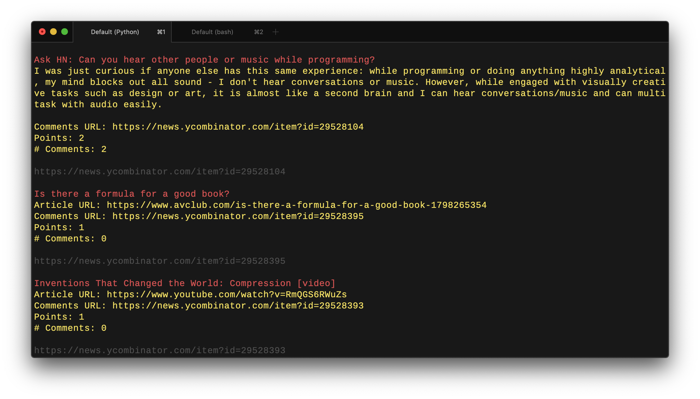

# hnsoup
Hackernews, live in your terminal

The idea is to have a stream of live data, as it comes in (approx 1-5min behind).

For fun, sit back and relax.

```
pipenv install
pipenv shell
python hnsoup --type posts     # for new posts, default is comments
```



MIT license
